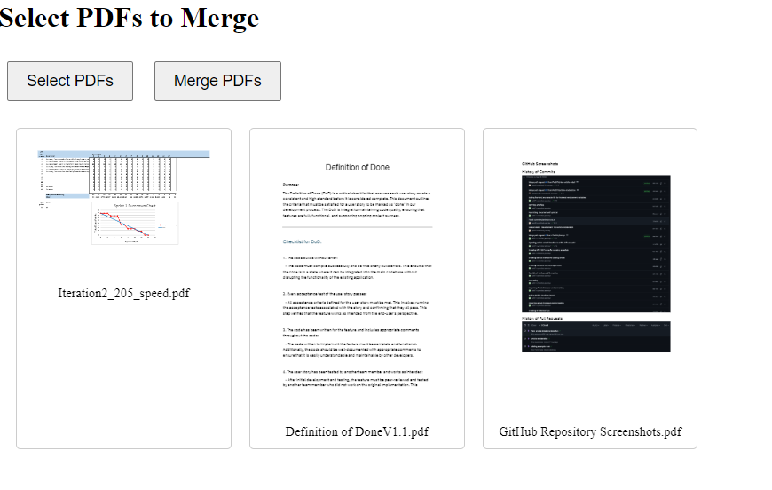

# PDF Merger
A desktop application that allows users to visually select, arrange, and merge PDF files. Built with Python, Eel, and PDF.js.

### Features
- Visual PDF selection and preview
- Drag-and-drop interface for reordering PDFs
- Thumbnail previews of the first page of each PDF
- Automatic saving to Downloads folder
- Cross-platform web application



#Development Setup

1. Clone or download the repository:

```
bashCopygit clone [repository-url]
cd pdf-merger
```

2. Create and activate a virtual environment:

```
python -m venv venv

# On Windows:
venv\Scripts\activate

# On macOS/Linux:
source venv/bin/activate
```

3. Install development dependencies:

```
pip install -r requirements.txt
```